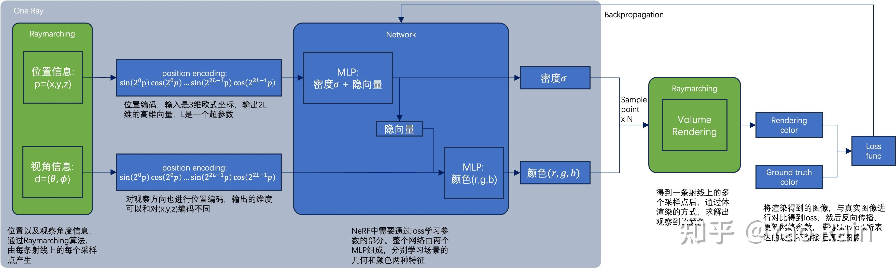
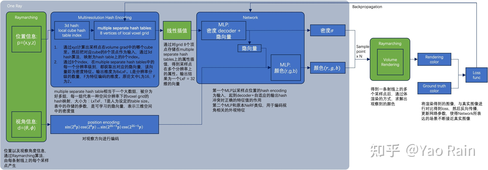

配置环境：
conda create --name instantngp-1 --clone nerf

python == 3.9

conda install pytorch==2.0.0 torchvision==0.15.0 torchaudio==2.0.0 pytorch-cuda=11.8 -c pytorch -c nvidia

#使用清华镜像（速度更快）
pip install torch==2.0.0 torchvision==0.15.0 torchaudio==2.0.0 \
  -i https://pypi.tuna.tsinghua.edu.cn/simple \
  --extra-index-url https://download.pytorch.org/whl/cu118

pip install torch==2.0.0+cu118 torchvision==0.22.0+cu118 -f https://download.pytorch.org/whl/torch_stable.html

pip list | grep torch  #查看当前torch版本

pip install nerfstudio

pip install -i https://pypi.tuna.tsinghua.edu.cn/simple git+https://github.com/NVlabs/tiny-cuda-nn/#subdirectory=bindings/torch  #安装tiny-cuda-nn

pip install -i https://pypi.tuna.tsinghua.edu.cn/simple git+https://github.com/NVlabs/tiny-cuda-nn/#subdirectory=bindings/torch

conda install -c conda-forge colmap  #安装colmap

安装tiny-cuda-nn：
git clone --recursive https://github.com/NVlabs/tiny-cuda-nn.git

cd tiny-cuda-nn

cmake . -B build   -DCMAKE_CUDA_ARCHITECTURES="86;89"   -DCMAKE_CUDA_COMPILER=/usr/local/cuda-12.9/bin/nvcc

cmake --build build --config RelWithDebInfo -j

cd bindings/torch

pip install .

命令说明：
下载数据集：ns-download-data nerfstudio --capture-name=poster #但是很慢，所以直接在网上找的下载下来放进目录里；

处理数据：ns-process-data images --data data/images --output-dir data/custom

训练模型：
export CUDA_VISIBLE_DEVICES=0,1,2,3 #只使用89，因为86有compile错误
ns-train instant-ngp --data data/nerfstudio/poster

查看结果：训练完可以通过运行tensorboard查看日志，但是现在环境还没配完。训练的过程可以通过端口查看。

可视化结果：
ns-viewer --load-config {outputs/.../config.yml}
#--load-config PATH
#Path 是生成的config.yml
#例子
ns-viewer --load-config train/colmap/nerfacto/2024-04-22_162813/config.yml

导出点云：
ns-export pointcloud -h #查看需要哪些参数
#例子
ns-export pointcloud --load-config outputs/fern/nerfacto/2024-04-18_100522/config.yml --output-dir exports/pcd/ --num-points 1000000 --remove-outliers True --normal-method open3d --use_bounding_box False --save-world-frame False --obb_center 0.0000000000 0.0000000000 0.0000000000 --obb_rotation 0.0000000000 0.0000000000 0.0000000000 --obb_scale 1.0000000000 1.0000000000 1.0000000000

nerf pipeline:

instant ngp pipeline:(用参数化显式表达加速pipeline)

Instant-NGP与NeRF的异同：
同样基于体渲染
不同于NeRF的MLP，NGP使用稀疏的参数化的voxel grid作为场景表达；(the key)
基于梯度，同时优化场景和MLP（其中一个MLP用作decoder）。

export CUDA_HOME=/usr/local/cuda-12.9
export PATH=$CUDA_HOME/bin:$PATH
export LD_LIBRARY_PATH=$CUDA_HOME/lib64:$LD_LIBRARY_PATH  #执行这三句之后就可以 nvcc --

export LD_PRELOAD=$CONDA_PREFIX/lib/libstdc++.so.6  #ldd $(which python) | grep libstdc++ 检验  不对

export LD_PRELOAD=$(g++ -print-file-name=libstdc++.so.6)

#ImportError: /mnt/disk2/jiyun.hu/miniconda3/envs/instantngp/lib/libstdc++.so.6: version `GLIBCXX_3.4.32' not found (required by /mnt/disk2/jiyun.hu/.cache/torch_extensions/py39_cu121/nerfacc_cuda/nerfacc_cuda.so)

export CUDA_VISIBLE_DEVICES=0,1,2,3

ns-train instant-ngp --data data/custom --vis viewer+tensorboard
ns-viewer --load-config outputs/custom/instant-ngp/2025-05-29_123740/config.yml
tensorboard --logdir=outputs/custom/instant-ngp/2025-05-29_114438

ns-eval --load-config outputs/custom/instant-ngp/2025-05-29_123740/config.yml --render-output-path renders

camera-path生成：
使用ns-viewer到网页端，然后在render模块，插入关键帧，形成loop，点击generate command就可以了。

ns-render camera-path 
  --load-config outputs/custom/instant-ngp/2025-05-29_123740/config.yml 
  --camera-path-filename outputs/custom/instant-ngp/2025-05-29_123740/camera_paths/easy.json 
  --output-path renders/easy_path.mp4

ns-render camera-path 
  --load-config outputs/custom/instant-ngp/2025-05-29_123740/config.yml 
  --camera-path-filename camera_paths/360_camera_paths.json 
  --output-path renders/easy_path360.mp4

ns-render interpolate --load-config outputs/custom/instant-ngp/2025-05-29_123740/config.yml  --output-path renders/easy_path1.mp4

ns-render spiral --load-config outputs/custom/instant-ngp/2025-05-29_123740/config.yml  --output-path renders/easy_path1.mp4

-h, --help                                                     │ │ Machine configuration                                          │
│     show this help message and exit                            │ │ ────────────────────────────────────────────────────────────── │
│ --output-dir PATH                                              │ │ --machine.seed INT                                             │
│     relative or absolute output directory to save all          │ │     random seed initialization (default: 42)                   │
│     checkpoints and logging (default: outputs)                 │ │ --machine.num-devices INT                                      │
│ --method-name {None}|STR                                       │ │     total number of devices (e.g., gpus) available for         │
│     Method name. Required to set in python or via cli          │ │     train/eval (default: 1)                                    │
│     (default: instant-ngp)                                     │ │ --machine.num-machines INT                                     │
│ --experiment-name {None}|STR                                   │ │     total number of distributed machines available (for DDP)   │
│     Experiment name. If None, will automatically be set to     │ │     (default: 1)                                               │
│     dataset name (default: None)                               │ │ --machine.machine-rank INT                                     │
│ --project-name {None}|STR                                      │ │     current machine's rank (for DDP) (default: 0)              │
│     Project name. (default: nerfstudio-project)                │ │ --machine.dist-url STR                                         │
│ --timestamp STR                                                │ │     distributed connection point (for DDP) (default: auto)     │
│     Experiment timestamp. (default: '{timestamp}')             │ │ --machine.device-type {cpu,cuda,mps}                           │
│ --vis                                                          │ │     device type to use for training (default: cuda)            │
│ {viewer,wandb,tensorboard,comet,viewer+wandb,viewer+tensorboar │ ╰────────────────────────────────────────────────────────────────╯
│ d,viewer+comet,viewer_legacy}                                  │ ╭─ logging options ──────────────────────────────────────────────╮
│     Which visualizer to use. (default: viewer)                 │ │ Logging configuration                                          │
│ --data {None}|PATH                                             │ │ ────────────────────────────────────────────────────────────── │
│     Alias for --pipeline.datamanager.data (default: None)      │ │ --logging.relative-log-dir PATH                                │
│ --prompt {None}|STR                                            │ │     relative path to save all logged events (default: .)       │
│     Alias for --pipeline.model.prompt (default: None)          │ │ --logging.steps-per-log INT                                    │
│ --relative-model-dir PATH                                      │ │     number of steps between logging stats (default: 10)        │
│     Relative path to save all checkpoints. (default:           │ │ --logging.max-buffer-size INT                                  │
│     nerfstudio_models)                                         │ │     maximum history size to keep for computing running         │
│ --load-scheduler {True,False}                                  │ │     averages of stats.                                         │
│     Whether to load the scheduler state_dict to resume         │ │     e.g. if 20, averages will be computed over past 20         │
│     training, if it exists. (default: True)                    │ │     occurrences. (default: 20)                                 │
│ --steps-per-save INT                                           │ │ --logging.profiler {none,basic,pytorch}                        │
│     Number of steps between saves. (default: 2000)             │ │     how to profile the code;                                   │
│ --steps-per-eval-batch INT                                     │ │     "basic" - prints speed of all decorated functions at the   │
│     Number of steps between randomly sampled batches of rays.  │ │     end of a program.                                          │
│     (default: 500)                                             │ │     "pytorch" - same as basic, but it also traces few training │
│ --steps-per-eval-image INT                                     │ │     steps. (default: basic)                                    │
│     Number of steps between single eval images. (default: 500) │ ╰────────────────────────────────────────────────────────────────╯
│ --steps-per-eval-all-images INT                                │ ╭─ logging.local-writer options ─────────────────────────────────╮
│     Number of steps between eval all images. (default: 25000)  │ │ if provided, will print stats locally. if None, will disable   │
│ --max-num-iterations INT                                       │ │ printing                                                       │
│     Maximum number of iterations to run. (default: 30000)      │ │ ────────────────────────────────────────────────────────────── │
│ --mixed-precision {True,False}                                 │ │ --logging.local-writer.enable {True,False}                     │
│     Whether or not to use mixed precision for training.        │ │     if True enables local logging, else disables (default:     │
│     (default: True)                                            │ │     True)                                                      │
│ --use-grad-scaler {True,False}                                 │ │ --logging.local-writer.stats-to-track                          │
│     Use gradient scaler even if the automatic mixed precision  │ │ [{ITER_TRAIN_TIME,TOTAL_TRAIN_TIME,ETA,TRAIN_RAYS_PER_SEC,TEST │
│     is disabled. (default: False)                              │ │ _RAYS_PER_SEC,VIS_RAYS_PER_SEC,CURR_TEST_PSNR} [...]]          │
│ --save-only-latest-checkpoint {True,False}                     │ │     specifies which stats will be logged/printed to terminal   │
│     Whether to only save the latest checkpoint or all          │ │     (default: ITER_TRAIN_TIME TRAIN_RAYS_PER_SEC               │
│     checkpoints. (default: True)                               │ │     CURR_TEST_PSNR VIS_RAYS_PER_SEC TEST_RAYS_PER_SEC ETA)     │
│ --load-dir {None}|PATH                                         │ │ --logging.local-writer.max-log-size INT                        │
│     Optionally specify a pre-trained model directory to load   │ │     maximum number of rows to print before wrapping. if 0,     │
│     from. (default: None)                                      │ │     will print everything. (default: 10)                       │
│ --load-step {None}|INT                                         │ ╰────────────────────────────────────────────────────────────────╯
│     Optionally specify model step to load from; if none, will  │ ╭─ viewer options ───────────────────────────────────────────────╮
│     find most recent model in load_dir. (default: None)        │ │ Viewer configuration                                           │
│ --load-config {None}|PATH                                      │ │ ────────────────────────────────────────────────────────────── │
│     Path to config YAML file. (default: None)                  │ │ --viewer.relative-log-filename STR                             │
│ --load-checkpoint {None}|PATH                                  │ │     Filename to use for the log file. (default:                │
│     Path to checkpoint file. (default: None)                   │ │     viewer_log_filename.txt)                                   │
│ --log-gradients {True,False}                                   │ │ --viewer.websocket-port {None}|INT                             │
│     Optionally log gradients during training (default: False)  │ │     The websocket port to connect to. If None, find an         │
│ --gradient-accumulation-steps [STR INT [STR INT ...]]          │ │     available port. (default: None)                            │
│     Number of steps to accumulate gradients over. Contains a   │ │ --viewer.websocket-port-default INT                            │
│     mapping of {param_group:num} (default: )                   │ │     The default websocket port to connect to if websocket_port │
│ --start-paused {True,False}                                    │ │     is not specified (default: 7007)                           │
│     Whether to start the training in a paused state. (default: │ │ --viewer.websocket-host STR                                    │
│     False)
